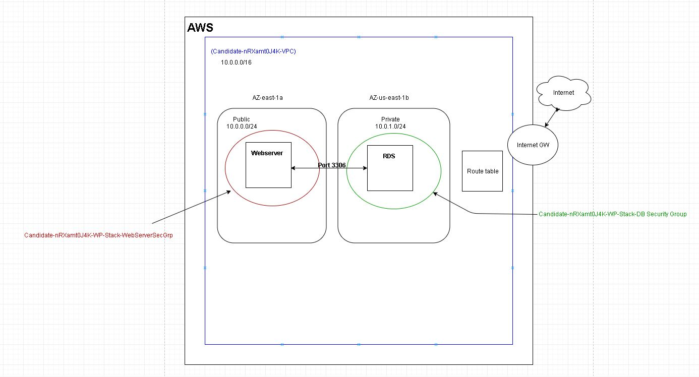
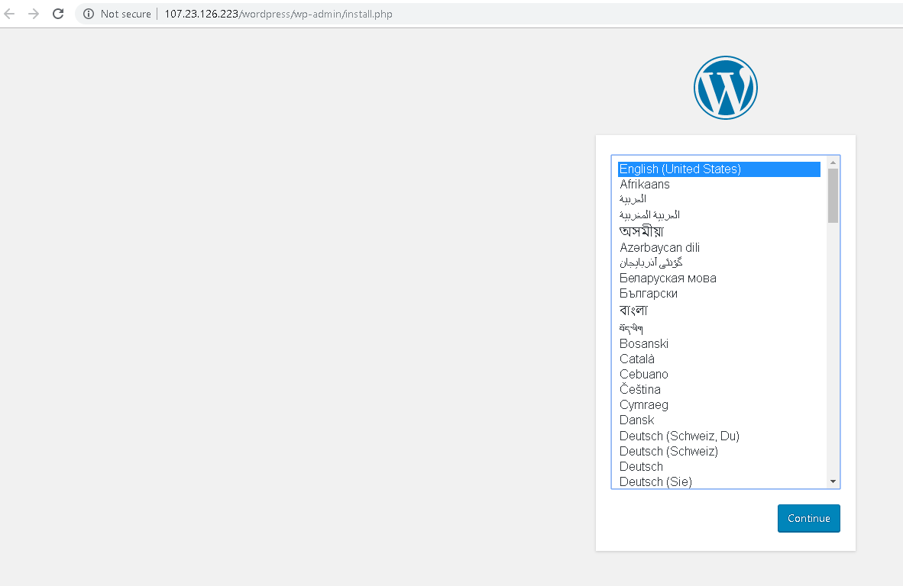
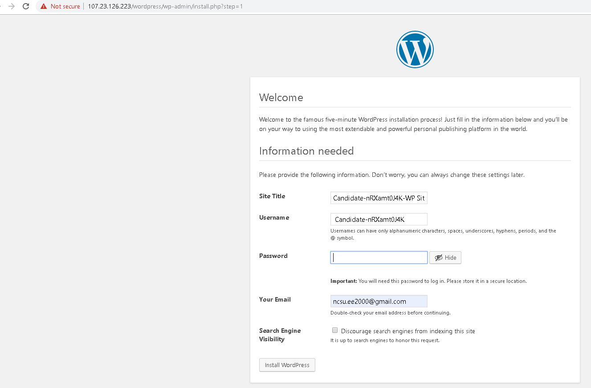
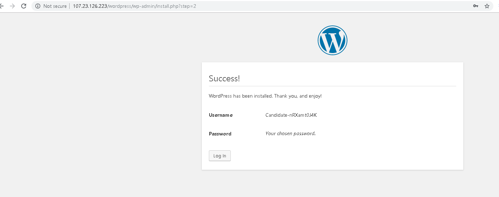
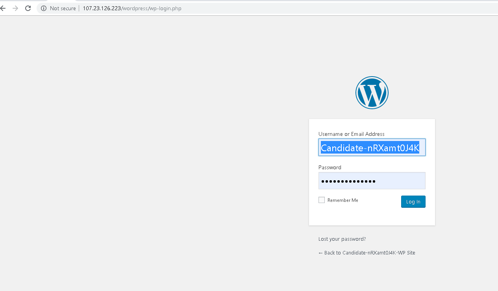
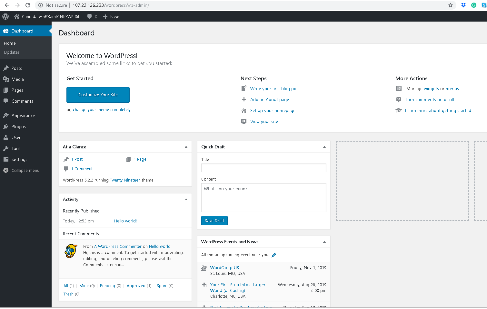

# Deploying Wordpress Site using Ansible and CloudFormation

This is a wordpress site using Ansible and CloudFormation Template. 
The following Prerequisites will need to be installed on the ansible server. 
Total setup time can be 30-60 minutes depending on experience and proper API access permissions. 

Pre-Requisites:
- awscli
- git
- python3-boto
- ansible
- 

The following stacks were built using Ansible Playbook

  - 1 VPC
      - Creates a default "Main Route Table", "Security Groups", "Network ACL"
  - 1 Public Subnet in VPC
  - 2 Private Subnets in VPC  
  - 2 Security Groups (1 WebServer SG, 1 DB Instance SG)
      - DBSecGroup : Allows traffic only on DB port 3306
      - WebServerSecGroup : Allows traffic on SSH (22) and HTTP(80) ports, Customer ICMP(IP4) to allow network troubleshooting   
  - 1 EC2 Instance for WebServer ( Public Subnet )  
  - 1 RDS Instance for Wordpress Database ( Private Subnet )
  - 1 Internet Gateway
  - 1 Route Table and 1 Route for the internet attached to the Public Subnet





### Instructions to Use (For Linux-Ubuntu/Redhat Users)

1. Create a keypair by logging into your AWS console, click on EC2, stroll down and you will see keypair on left menu. 

Be sure to remember the name of the keypair. We will use the created keypair to ssh into ec2 instances.

You may need to setup a credentials file in order to use the provision resources. If so, you will need your `access_key` and `secret_access_key` file to insert into the 'credential' file as follows below, BUT ( simply running aws configure after you have installed awscli on the Ansible server, and inputting the 'access key' and 'secret key' should be all you need to authenticate without using the 'credentials file'.

###Steps to install 'credentials' file.

Create a folder name `.aws` in your home directory, if haven't already been created when you installed awscli, using the following command

```
mkdir ~/.aws/
```

Next create `credentials` file in `~/.aws/` folder, using

```
touch credentials
```

Next, add your keys to the credentials file. 
Replace `your_access_key` and `your_secret_access_key` with the keys provided to you. Add these lines in your credentials file.

```
[default]
aws_access_key_id=your_access_key
aws_secret_access_key=your_secret_access_key
```

Now lets download this repository. Run

```
git clone https://github.com/iestarks/hitachi_cf_wordpress_lab.git
```

Add the following to file `/etc/ansible/hosts`

```
[local]
localhost
```

Then,

```
cd ~/.aws
```

and provision the stack run the following,

```
ansible-playbook -i /etc/ansible/hosts automate.yml --vvvv
```

Once the stack creation is complete open your browser and goto  (replace WebServerPublicIp with your WebServers IP)

```
http://WebServer-PublicIp/wordpress/wp-admin/install.php
```

You will see the setup page as below 



Next, after you select the language of your choice, enter your details 






Now you are done. You will see the following,



### References
